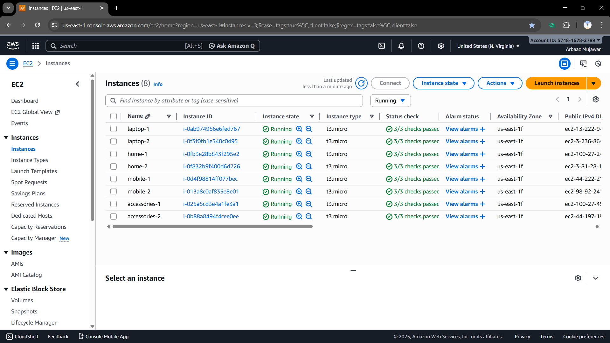
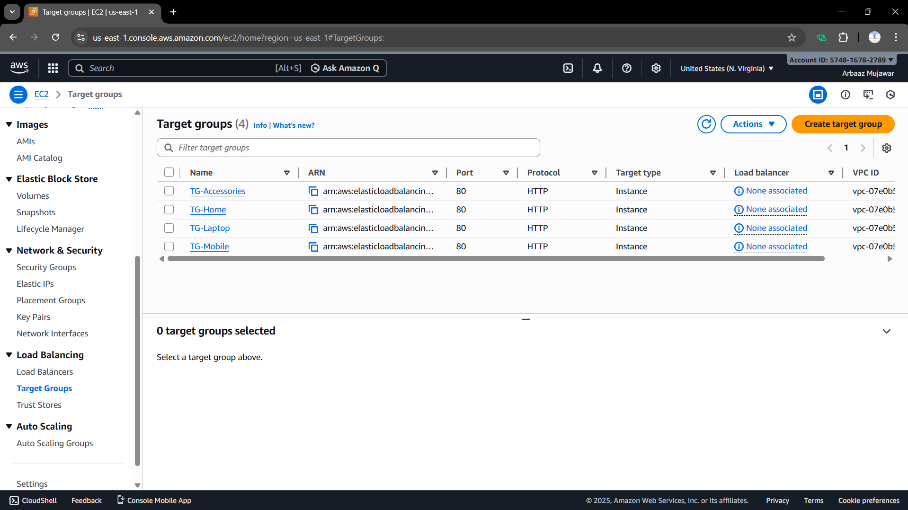
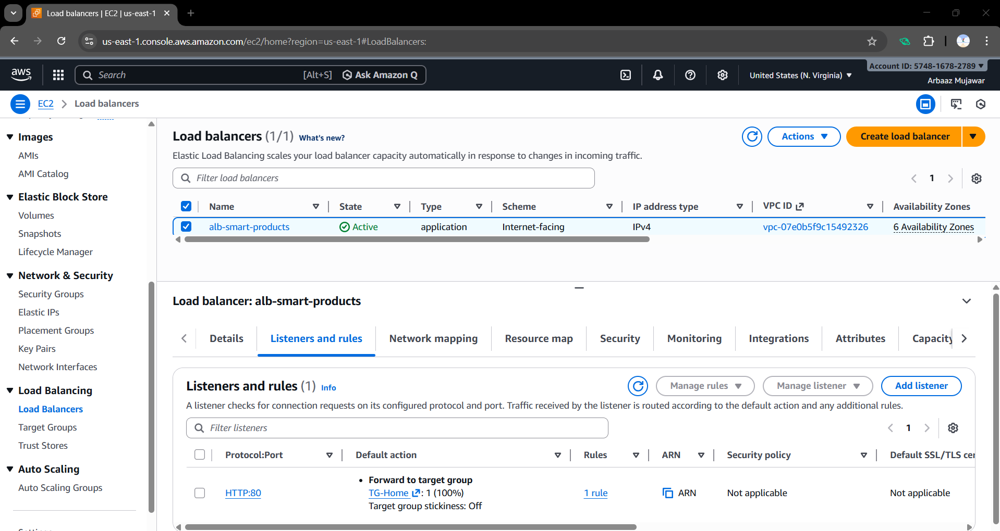
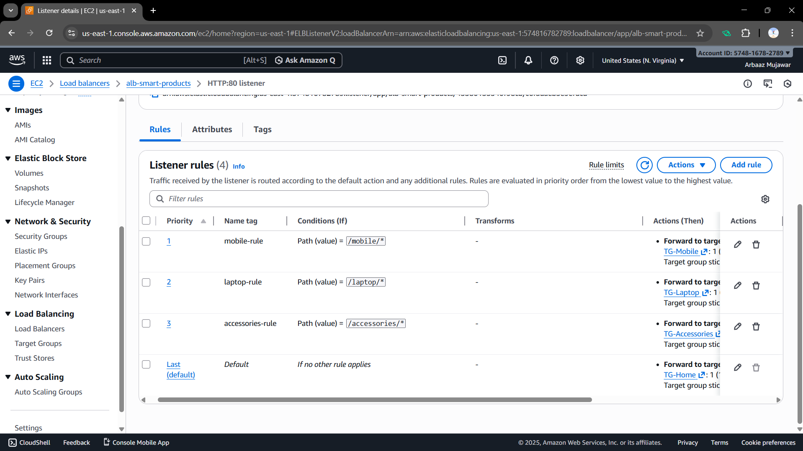
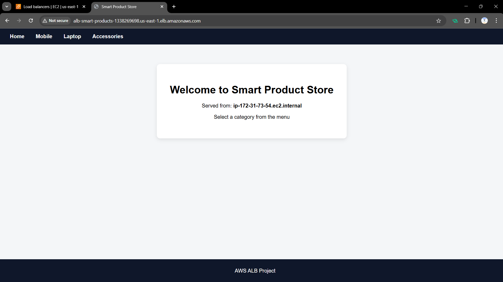
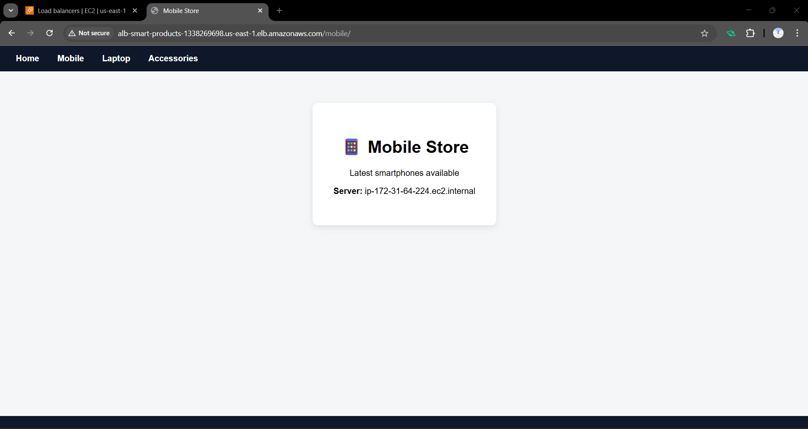
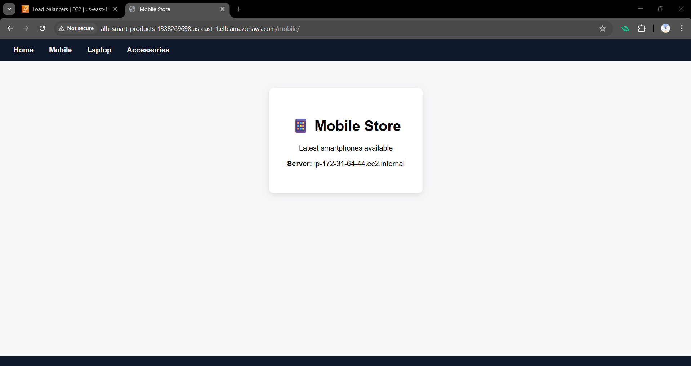
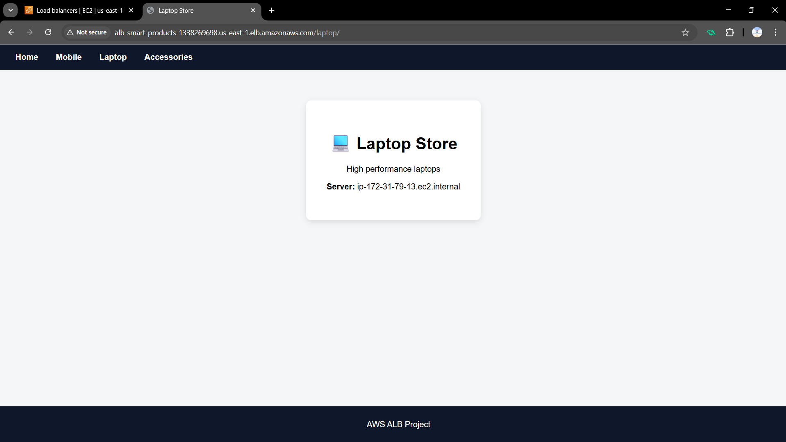
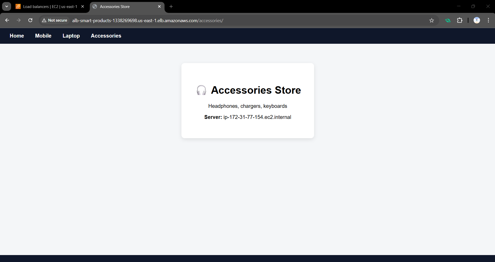

# **AWS Application Load Balancer Multi-Page Website Project**

## **Project Overview:**

This project demonstrates a real-world implementation of AWS Application Load Balancer (ALB) using path-based routing to distribute traffic across multiple backend services.

Each service runs on dedicated EC2 instances, ensuring:

1. High Availability

2. Fault Tolerance

3. Scalability

The project includes a professional UI, navigation-based routing, and dynamic hostname display to prove load balancing.

# **Project:** Smart Product Website using AWS Application Load Balancer (ALB).

---

# **Pages & Infrastructure Summary:**

**Screenshot:**


---

| Page        | URL Path       | EC2 Instances | Target Group   |
| ----------- | -------------- | ------------- | -------------- |
| Home        | `/`            | 2             | TG-Home        |
| Mobile      | `/mobile`      | 2             | TG-Mobile      |
| Laptop      | `/laptop`      | 2             | TG-Laptop      |
| Accessories | `/accessories` | 2             | TG-Accessories |

Total EC2 Instances: 8

Total Target Groups: 4

---

# **Step-by-Step Deployment Guide:**

This section explains everything from EC2 launch → Target Groups → ALB → Testing.

# **1️) Launch EC2 Instances:**

We need 8 EC2 instances (2 per page) to achieve high availability.

### **Steps:**

1. Go to AWS Console → EC2 → Launch Instance

2. AMI: Amazon Linux

3. Instance Type: t2.micro / t3.micro

4. Key Pair: Select or create one

5. etwork: Default VPC

6. Subnet: Any public subnet

7. Auto-assign Public IP: Enable

### **Security Group (IMPORTANT)**

1. SSH (22) → Your IP

2. HTTP (80) → Anywhere (0.0.0.0/0)

3. HTTPS (443) → Anywhere (0.0.0.0/0)

### **Naming Convention**

| Page / Service | Instance Name Prefix | Example Instance Names           |
| -------------- | -------------------- | -------------------------------- |
| Home           | `home`               | `home-1`, `home-2`               |
| Mobile         | `mobile`             | `mobile-1`, `mobile-2`           |
| Laptop         | `laptop`             | `laptop-1`, `laptop-2`           |
| Accessories    | `accessories`        | `accessories-1`, `accessories-2` |

**Screenshot:**


---

# **2️) Configure EC2 Using User Data (Apache + UI)**

Each EC2 instance uses User Data to automatically install Apache and deploy the UI.

### **Why User Data?**

1. Automation

2. No manual SSH work

3. Industry best practice

#### Paste the page-specific User Data script while launching EC2.

---

# **3️) Home Page (Base Landing Page):**

This is the default page routed by ALB.

## **User Data Script (Home EC2)**

```bash
#!/bin/bash
sudo yum update -y
sudo yum install -y httpd
sudo systemctl start httpd
sudo systemctl enable httpd

cat <<EOF > /var/www/html/index.html
<!DOCTYPE html>
<html>
<head>
<title>Smart Product Store</title>
<style>
body { margin:0; font-family: Arial, Helvetica, sans-serif; background:#f4f6f8; }
header { background:#0f172a; padding:15px; }
nav a { color:white; margin:15px; text-decoration:none; font-weight:bold; }
nav a:hover { color:#38bdf8; }
.container { padding:60px; text-align:center; }
.card { background:white; padding:40px; border-radius:10px; box-shadow:0 4px 12px rgba(0,0,0,0.1); display:inline-block; }
footer { background:#0f172a; color:white; text-align:center; padding:10px; position:fixed; bottom:0; width:100%; }
.button { display:inline-block; margin:10px; padding:12px 25px; background:#2563eb; color:white; text-decoration:none; border-radius:6px; }
.button:hover { background:#1e40af; }
</style>
</head>
<body>
<header>
<nav>
<a href="/home">Home</a>
<a href="/mobile/">Mobile</a>
<a href="/laptop/">Laptop</a>
<a href="/accessories/">Accessories</a>
</nav>
</header>


<div class="container">
<div class="card">
<h1>Welcome to Smart Product Store</h1>
<p>Served from: <b>$(hostname -f)</b></p>
<p>Select a category from the menu</p>
</div>
</div>


<footer>
<p>AWS ALB Project</p>
</footer>
</body>
</html>
EOF
```

---

# **4️) Mobile Page**

Path: /mobile/

## **User Data Script (Mobile EC2)**

```bash
#!/bin/bash
sudo yum update -y
sudo yum install -y httpd
sudo systemctl start httpd
sudo systemctl enable httpd

sudo mkdir -p /var/www/html/mobile

cat <<EOF > /var/www/html/mobile/index.html
<!DOCTYPE html>
<html>
<head>
<title>Mobile Store</title>

<style>
body {
    margin: 0;
    font-family: Arial, Helvetica, sans-serif;
    background-color: #f4f6f8;
}

header {
    background-color: #0f172a;
    padding: 15px;
}

nav a {
    color: white;
    margin: 15px;
    text-decoration: none;
    font-weight: bold;
}

nav a:hover {
    color: #38bdf8;
}

.container {
    padding: 60px;
    text-align: center;
}

.card {
    background: white;
    padding: 40px;
    border-radius: 10px;
    box-shadow: 0 4px 12px rgba(0,0,0,0.1);
    display: inline-block;
}

footer {
    background-color: #0f172a;
    color: white;
    text-align: center;
    padding: 10px;
    position: fixed;
    bottom: 0;
    width: 100%;
}
</style>

</head>
<body>

<header>
<nav>
<a href="/">Home</a>
<a href="/mobile/">Mobile</a>
<a href="/laptop/">Laptop</a>
<a href="/accessories/">Accessories</a>
</nav>
</header>

<div class="container">
<div class="card">
<h1>📱 Mobile Store</h1>
<p>Latest smartphones available</p>
<p><b>Server:</b> $(hostname -f)</p>
</div>
</div>

<footer>
<p>AWS ALB Project</p>
</footer>

</body>
</html>
EOF

```

---

# **5️) Laptop Page**

Path: /laptop/

## **User Data Script (Laptop EC2)**

```bash
#!/bin/bash
sudo yum update -y
sudo yum install -y httpd
sudo systemctl start httpd
sudo systemctl enable httpd

sudo mkdir -p /var/www/html/laptop


cat <<EOF > /var/www/html/laptop/index.html
<!DOCTYPE html>
<html>
<head>
<title>Laptop Store</title>

<style>
body {
    margin: 0;
    font-family: Arial, Helvetica, sans-serif;
    background-color: #f4f6f8;
}

header {
    background-color: #0f172a;
    padding: 15px;
}

nav a {
    color: white;
    margin: 15px;
    text-decoration: none;
    font-weight: bold;
}

nav a:hover {
    color: #38bdf8;
}

.container {
    padding: 60px;
    text-align: center;
}

.card {
    background: white;
    padding: 40px;
    border-radius: 10px;
    box-shadow: 0 4px 12px rgba(0,0,0,0.1);
    display: inline-block;
}

footer {
    background-color: #0f172a;
    color: white;
    text-align: center;
    padding: 10px;
    position: fixed;
    bottom: 0;
    width: 100%;
}
</style>

</head>
<body>

<header>
<nav>
<a href="/">Home</a>
<a href="/mobile/">Mobile</a>
<a href="/laptop/">Laptop</a>
<a href="/accessories/">Accessories</a>
</nav>
</header>

<div class="container">
<div class="card">
<h1>💻 Laptop Store</h1>
<p>High performance laptops</p>
<p><b>Server:</b> $(hostname -f)</p>
</div>
</div>

<footer>
<p>AWS ALB Project</p>
</footer>

</body>
</html>
EOF

```

---

# **6️) Accessories Page**

Path: /accessories/

## **User Data Script (Accessories EC2)**

```bash
#!/bin/bash
sudo yum update -y
sudo yum install -y httpd
sudo systemctl start httpd
sudo systemctl enable httpd

sudo mkdir -p /var/www/html/accessories

cat <<EOF > /var/www/html/accessories/index.html
<!DOCTYPE html>
<html>
<head>
<title>Accessories Store</title>

<style>
body {
    margin: 0;
    font-family: Arial, Helvetica, sans-serif;
    background-color: #f4f6f8;
}

header {
    background-color: #0f172a;
    padding: 15px;
}

nav a {
    color: white;
    margin: 15px;
    text-decoration: none;
    font-weight: bold;
}

nav a:hover {
    color: #38bdf8;
}

.container {
    padding: 60px;
    text-align: center;
}

.card {
    background: white;
    padding: 40px;
    border-radius: 10px;
    box-shadow: 0 4px 12px rgba(0,0,0,0.1);
    display: inline-block;
}

footer {
    background-color: #0f172a;
    color: white;
    text-align: center;
    padding: 10px;
    position: fixed;
    bottom: 0;
    width: 100%;
}
</style>

</head>
<body>

<header>
<nav>
<a href="/">Home</a>
<a href="/mobile/">Mobile</a>
<a href="/laptop/">Laptop</a>
<a href="/accessories/">Accessories</a>
</nav>
</header>

<div class="container">
<div class="card">
<h1>🎧 Accessories Store</h1>
<p>Headphones, chargers, keyboards</p>
<p><b>Server:</b> $(hostname -f)</p>
</div>
</div>

<footer>
<p>AWS ALB Project</p>
</footer>

</body>
</html>
EOF

```

---

# **7️) Create Target Groups:**

Target Groups define where ALB forwards traffic.

## **Steps:**

1. Go to EC2 → Target Groups → Create target group

2. Target type: Instances

3. Protocol: HTTP, Port: 80

4. VPC: Same as EC2

## **Create 4 Target Groups:**

Each target group uses a **path-based health check** to ensure that only healthy EC2 instances receive traffic.

| Target Group   | Health Check Path |
| -------------- | ----------------- |
| TG-Home        | `/`               |
| TG-Mobile      | `/mobile/`        |
| TG-Laptop      | `/laptop/`        |
| TG-Accessories | `/accessories/`   |

## **Register Targets:**

Add 2 EC2 instances per target group

**Screenshot:**


---

# **8️) Create Application Load Balancer (ALB):**

## **Steps:**

1. Go to EC2 → Load Balancers → Create Load Balancer

2. Choose Application Load Balancer

3. Name: alb-smart-products

4. Scheme: Internet-facing

5. IP type: IPv4

6. VPC: Same VPC

7. Subnets: Select at least 2 public subnets

## **Security Group:**

Allow:

1. HTTP (80) → Anywhere

2. HTTPs (443) → Anywhere

**Screenshot:**


---

# **9️) Configure ALB Listener Rules (Path-Based Routing) :**

The Application Load Balancer routes incoming traffic based on the URL path patterns defined below.

## **Steps:**

1. Open ALB → Listeners → HTTP : 80

2. Add rules:

| Priority | Path Pattern     | Forward To     |
| -------- | ---------------- | -------------- |
| 1        | `/mobile/*`      | TG-Mobile      |
| 2        | `/laptop/*`      | TG-Laptop      |
| 3        | `/accessories/*` | TG-Accessories |
| Default  | `/*`             | TG-Home        |

**Screenshot:**


---

# **Testing & Verification:**

## **Steps:**

1. Copy ALB DNS name

2. Open browser:

3. Use navigation buttons to access pages

4. Refresh page multiple times

# **Load Balancing Verification (Screenshot Explanation):**

To verify that the Application Load Balancer (ALB) is correctly distributing traffic across multiple EC2 instances, multiple page refreshes were performed on the same URL.

Two screenshots were captured for the same page, and each screenshot displays a different server identity (IP address / hostname).

## **Home Page:**

**Screenshot:**


**Screenshot:**


---

## **Mobile Page:**

**Screenshot:**


**Screenshot:**


---

## **Laptop Page:**

**Screenshot:**


**Screenshot:**


---

## **Accessories Page:**

**Screenshot:**


**Screenshot:**


---
