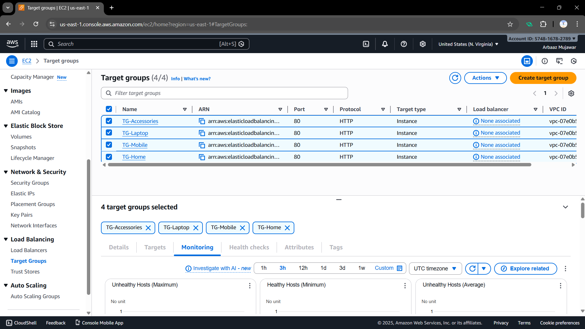
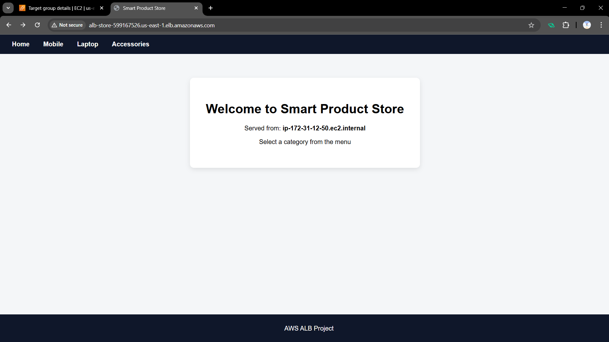
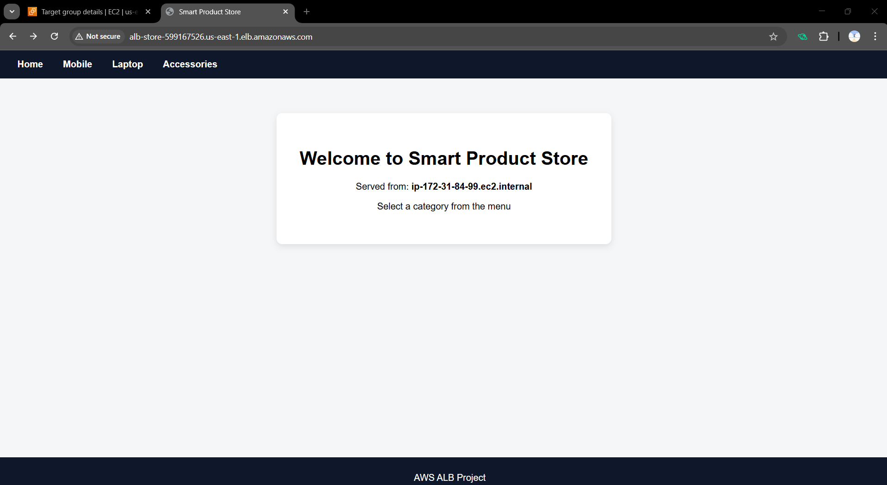
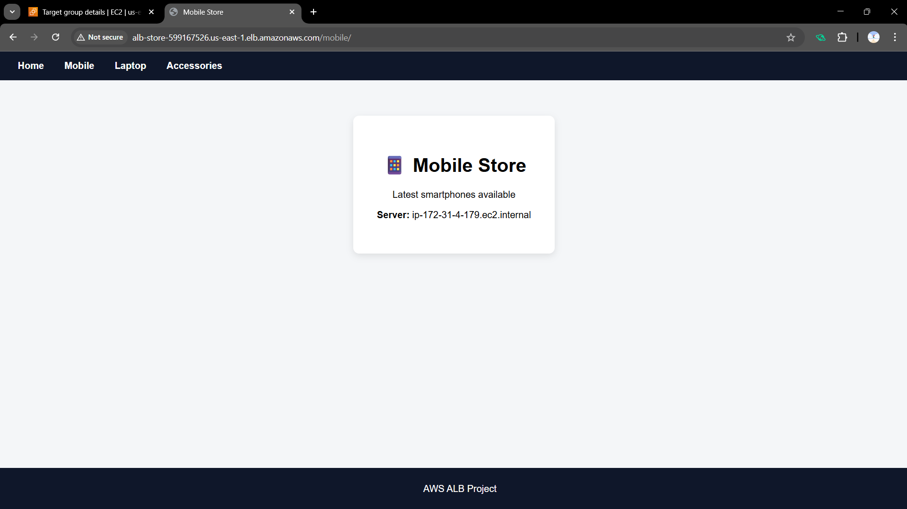
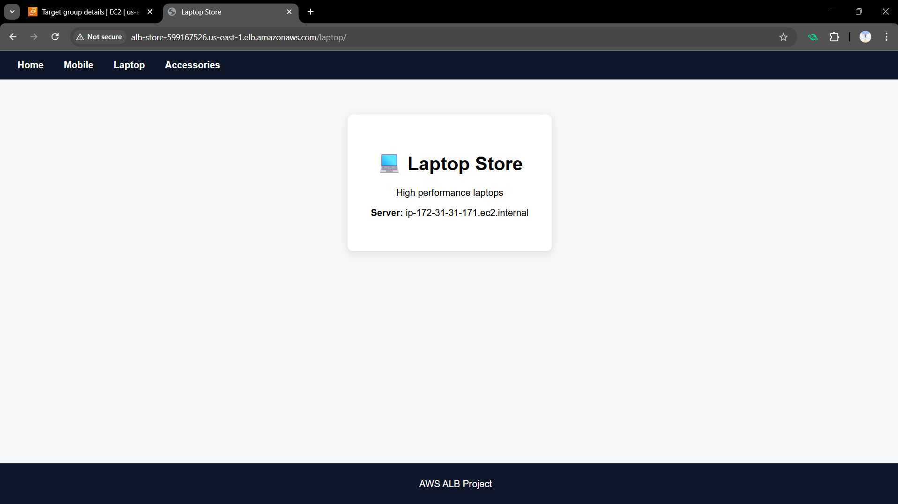

# **Projet: AWS Application Load Balancer with Auto Scaling Group**

## **Project Overview:**

This project demonstrates a production-ready AWS architecture using an
Application Load Balancer (ALB) integrated with Auto Scaling Groups (ASG)
to achieve high availability, scalability, and fault tolerance.

---

## **Architecture Diagram:**

The following diagram shows the high-level architecture of the application.

**Screenshot:**


---

## **Pre-Requirements:**

1. AWS account
2. EC2 Key Pair created
3. Region selected (example: us-east-1)
4. Default VPC available

---

# **STEP 1: Create Security Groups**

## **1. ALB Security Group:**

1. Go to EC2 → Security Groups
2. Click Create security group
3. Name: alb-sg
4. Description: ALB Security Group
5. VPC: Default VPC

Inbound Rule :

**HTTP (80) → Anywhere (0.0.0.0/0)**

**HTTPS (443) → Anywhere (0.0.0.0/0)**

## **2. EC2 Security Group**

1. Create another SG
2. Name: ec2-sg
3. VPC: Default VPC

Inbound Rule :

**HTTP (80) → Anywhere (0.0.0.0/0)**

**HTTPS (443) → Anywhere (0.0.0.0/0)**

**SSH (22) → Anywhere (0.0.0.0/0)**

---

# **STEP 2: Create Target Groups (DO NOT ADD INSTANCES)**

You will create 4 Target Groups.

## **Target Group Creation (Repeat 4 times):**

1. Go to EC2 → Target Groups

2. Click Create target group

3. Target type: Instances

4. Protocol: HTTP

5. Port: 80

6. VPC: Default VPC

7. Click Next

## **Health Check Config:**

| Service     | Path            |
| ----------- | --------------- |
| Home        | `/`             |
| Mobile      | `/mobile/`      |
| Laptop      | `/laptop/`      |
| Accessories | `/accessories/` |

**Imp: DO NOT REGISTER INSTANCES**

Click Create target group

**Screenshot:**


---

# **STEP 3: Create Launch Templates**

Launch Templates define how EC2 is created.

You must create 4 Launch Templates.

## **Launch Template Creation (Example: Home)**

1. Go to EC2 → Launch Templates

2. Click Create launch template

### **Basic details:**

1. Name: lt-home

2. Version description: Home Template

### **AMI:**

Amazon Linux 2

### **Instance Type:**

t2.micro / t3.micro (Any)

### **Key pair:**

Select your key pair

### **Network:**

Security Group: sg-ec2

---

### **Advanced details → User Data**

For Home :

```bash
#!/bin/bash
sudo yum update -y
sudo yum install -y httpd
sudo systemctl start httpd
sudo systemctl enable httpd

cat <<EOF > /var/www/html/index.html
<!DOCTYPE html>
<html>
<head>
<title>Smart Product Store</title>
<style>
body { margin:0; font-family: Arial, Helvetica, sans-serif; background:#f4f6f8; }
header { background:#0f172a; padding:15px; }
nav a { color:white; margin:15px; text-decoration:none; font-weight:bold; }
nav a:hover { color:#38bdf8; }
.container { padding:60px; text-align:center; }
.card { background:white; padding:40px; border-radius:10px; box-shadow:0 4px 12px rgba(0,0,0,0.1); display:inline-block; }
footer { background:#0f172a; color:white; text-align:center; padding:10px; position:fixed; bottom:0; width:100%; }
.button { display:inline-block; margin:10px; padding:12px 25px; background:#2563eb; color:white; text-decoration:none; border-radius:6px; }
.button:hover { background:#1e40af; }
</style>
</head>
<body>
<header>
<nav>
<a href="/home">Home</a>
<a href="/mobile/">Mobile</a>
<a href="/laptop/">Laptop</a>
<a href="/accessories/">Accessories</a>
</nav>
</header>


<div class="container">
<div class="card">
<h1>Welcome to Smart Product Store</h1>
<p>Served from: <b>$(hostname -f)</b></p>
<p>Select a category from the menu</p>
</div>
</div>


<footer>
<p>AWS ALB Project</p>
</footer>
</body>
</html>
EOF
```

Click Create launch template.

### **Repeat for:**

| Service     | Template       | Folder                    |
| ----------- | -------------- | ------------------------- |
| Home        | lt-home        | /var/www/html             |
| Mobile      | lt-mobile      | /var/www/html/mobile      |
| Laptop      | lt-laptop      | /var/www/html/laptop      |
| Accessories | lt-accessories | /var/www/html/accessories |

**For Mobile:**

```bash
#!/bin/bash
sudo yum update -y
sudo yum install -y httpd
sudo systemctl start httpd
sudo systemctl enable httpd

sudo mkdir -p /var/www/html/mobile

cat <<EOF > /var/www/html/mobile/index.html
<!DOCTYPE html>
<html>
<head>
<title>Mobile Store</title>

<style>
body {
    margin: 0;
    font-family: Arial, Helvetica, sans-serif;
    background-color: #f4f6f8;
}

header {
    background-color: #0f172a;
    padding: 15px;
}

nav a {
    color: white;
    margin: 15px;
    text-decoration: none;
    font-weight: bold;
}

nav a:hover {
    color: #38bdf8;
}

.container {
    padding: 60px;
    text-align: center;
}

.card {
    background: white;
    padding: 40px;
    border-radius: 10px;
    box-shadow: 0 4px 12px rgba(0,0,0,0.1);
    display: inline-block;
}

footer {
    background-color: #0f172a;
    color: white;
    text-align: center;
    padding: 10px;
    position: fixed;
    bottom: 0;
    width: 100%;
}
</style>

</head>
<body>

<header>
<nav>
<a href="/">Home</a>
<a href="/mobile/">Mobile</a>
<a href="/laptop/">Laptop</a>
<a href="/accessories/">Accessories</a>
</nav>
</header>

<div class="container">
<div class="card">
<h1>📱 Mobile Store</h1>
<p>Latest smartphones available</p>
<p><b>Server:</b> $(hostname -f)</p>
</div>
</div>

<footer>
<p>AWS ALB Project</p>
</footer>

</body>
</html>
EOF

```

**For Laptop:**

```bash
#!/bin/bash
sudo yum update -y
sudo yum install -y httpd
sudo systemctl start httpd
sudo systemctl enable httpd

sudo mkdir -p /var/www/html/laptop


cat <<EOF > /var/www/html/laptop/index.html
<!DOCTYPE html>
<html>
<head>
<title>Laptop Store</title>

<style>
body {
    margin: 0;
    font-family: Arial, Helvetica, sans-serif;
    background-color: #f4f6f8;
}

header {
    background-color: #0f172a;
    padding: 15px;
}

nav a {
    color: white;
    margin: 15px;
    text-decoration: none;
    font-weight: bold;
}

nav a:hover {
    color: #38bdf8;
}

.container {
    padding: 60px;
    text-align: center;
}

.card {
    background: white;
    padding: 40px;
    border-radius: 10px;
    box-shadow: 0 4px 12px rgba(0,0,0,0.1);
    display: inline-block;
}

footer {
    background-color: #0f172a;
    color: white;
    text-align: center;
    padding: 10px;
    position: fixed;
    bottom: 0;
    width: 100%;
}
</style>

</head>
<body>

<header>
<nav>
<a href="/">Home</a>
<a href="/mobile/">Mobile</a>
<a href="/laptop/">Laptop</a>
<a href="/accessories/">Accessories</a>
</nav>
</header>

<div class="container">
<div class="card">
<h1>💻 Laptop Store</h1>
<p>High performance laptops</p>
<p><b>Server:</b> $(hostname -f)</p>
</div>
</div>

<footer>
<p>AWS ALB Project</p>
</footer>

</body>
</html>
EOF

```

**For Accessories :**

```bash
#!/bin/bash
sudo yum update -y
sudo yum install -y httpd
sudo systemctl start httpd
sudo systemctl enable httpd

sudo mkdir -p /var/www/html/accessories

cat <<EOF > /var/www/html/accessories/index.html
<!DOCTYPE html>
<html>
<head>
<title>Accessories Store</title>

<style>
body {
    margin: 0;
    font-family: Arial, Helvetica, sans-serif;
    background-color: #f4f6f8;
}

header {
    background-color: #0f172a;
    padding: 15px;
}

nav a {
    color: white;
    margin: 15px;
    text-decoration: none;
    font-weight: bold;
}

nav a:hover {
    color: #38bdf8;
}

.container {
    padding: 60px;
    text-align: center;
}

.card {
    background: white;
    padding: 40px;
    border-radius: 10px;
    box-shadow: 0 4px 12px rgba(0,0,0,0.1);
    display: inline-block;
}

footer {
    background-color: #0f172a;
    color: white;
    text-align: center;
    padding: 10px;
    position: fixed;
    bottom: 0;
    width: 100%;
}
</style>

</head>
<body>

<header>
<nav>
<a href="/">Home</a>
<a href="/mobile/">Mobile</a>
<a href="/laptop/">Laptop</a>
<a href="/accessories/">Accessories</a>
</nav>
</header>

<div class="container">
<div class="card">
<h1>🎧 Accessories Store</h1>
<p>Headphones, chargers, keyboards</p>
<p><b>Server:</b> $(hostname -f)</p>
</div>
</div>

<footer>
<p>AWS ALB Project</p>
</footer>

</body>
</html>
EOF
```

**Screenshot:**


---

# **STEP 4: Create Auto Scaling Groups (ASG)**

Now ASG will create EC2 instances automatically.

## **ASG Creation (Example: Home)**

1. Go to EC2 → Auto Scaling Groups

2. Click Create Auto Scaling group

### **Step 1: Name**

1. Name: asg-home

### **Step 2: Launch Template**

1. Choose existing template

2. Select lt-home

### **Step 3: Network**

1. VPC: Default VPC

2. Subnets: Select all public subnets

---

### **Step 4: Attach Load Balancer**

1. Check Attach to an existing load balancer

2. Choose Target Group
   Select TG-Home

---

### **Step 5: Capacity**

| Setting | Value |
| ------- | ----- |
| Min     | 1     |
| Desired | 2     |
| Max     | 3     |

---

### **Step 6: Scaling Policy**

1. Target Tracking

2. Average CPU = 50%

**Click Create ASG**

---

### **Repeat for:**

1. asg-mobile → TG-Mobile

2. asg-laptop → TG-Laptop

3. asg-accessories → TG-Accessories

**Screenshot:**


---

# **STEP 5: Create Application Load Balancer (ALB)**

## **ALB Creation Steps:**

1. Go to EC2 → Load Balancers

2. Click Create Load Balancer

3. Select Application Load Balancer

---

## **Configure:**

1. Name: alb-store

2. Scheme: Internet-facing

3. IP type: IPv4

4. Listener: HTTP (80)

---

## **Network Mapping:**

1. VPC: Default

2. Subnets: Select all public subnets

---

## **Security Group:**

Select sg-alb

---

## **Default Target Group:**

1. Select TG-Home

Click Create ALB

---

# **STEP 6: Configure Listener Rules (Path-Based Routing)**

1. Go to Load Balancers → alb-store

2. Click Listeners → HTTP:80 → View/Edit rules

## **Add Rules:**

| Priority | Path            | Forward to     |
| -------- | --------------- | -------------- |
| 1        | /mobile/\*      | TG-Mobile      |
| 2        | /laptop/\*      | TG-Laptop      |
| 3        | /accessories/\* | TG-Accessories |
| Default  | /\*             | TG-Home        |

Save rules.

**Screenshot:**


---

# **STEP 7: Verify Target Groups**

1. Go to Target Groups

2. Open each TG

3. Check Targets tab

4. Status should be Healthy

5. Source = Auto Scaling

---

# **STEP 8: Test Application**

Get ALB DNS Name.

## **Test URLs:**

```
http://ALB-DNS/
http://ALB-DNS/mobile/
http://ALB-DNS/laptop/
http://ALB-DNS/accessories/
```

# **STEP 9: Verify Load Balancing**

1. Refresh same URL multiple times

2. Observe hostname changes

**Screenshot:**


**Screenshot:**


---

**Screenshot:**


---

**Screenshot:**


---

**Screenshot:**


---
