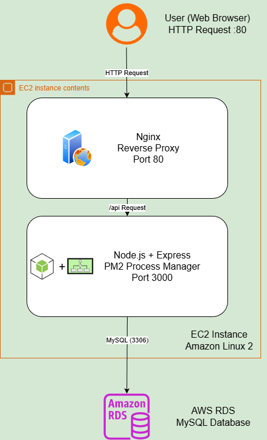
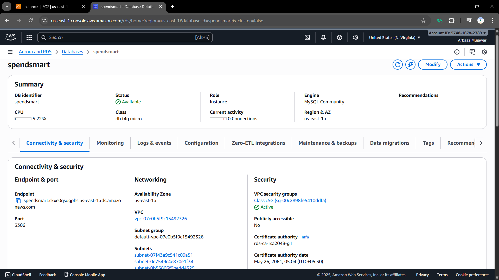
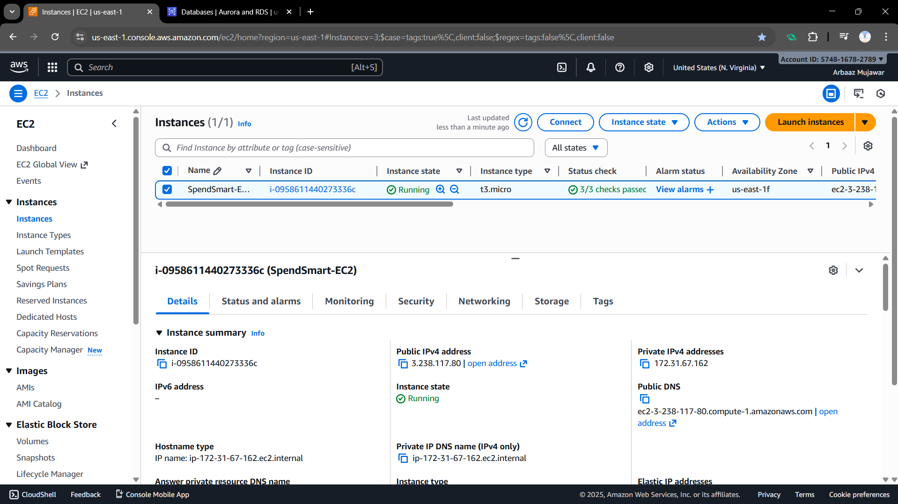
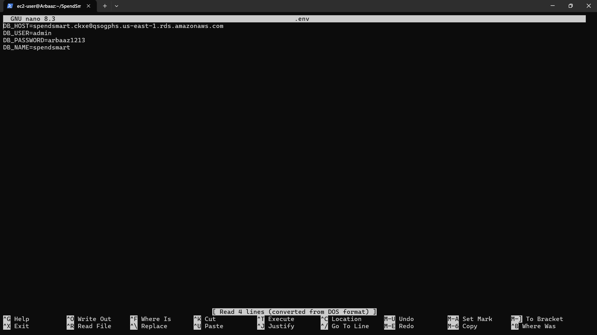
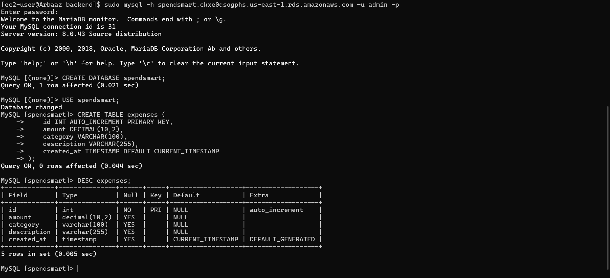
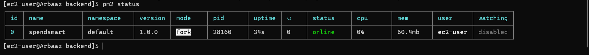
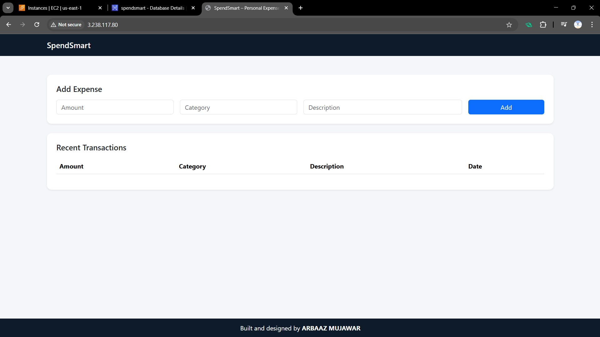
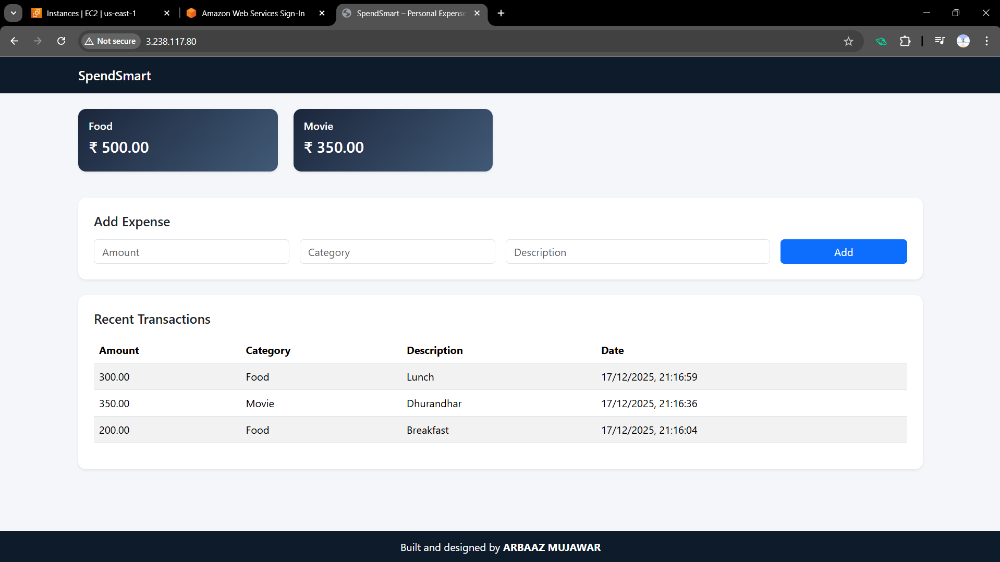

# **SpendSmart – Cloud Deployment Project (AWS EC2 + Nginx + Node.js + PM2 + RDS)**

SpendSmart is a cloud deployment–focused project designed to demonstrate how a web application can be deployed, managed, and scaled on AWS infrastructure using EC2, Nginx, Node.js, PM2, RDS.

This project primarily focuses on:

- Server setup
- Reverse proxy configuration
- Database hosting on AWS RDS
- Process management
- Production-grade deployment practices

---

## **Project Objective :**

The main goal of this project is to gain hands-on experience in cloud computing concepts, including:

- Deploying applications on AWS EC2
- Using AWS RDS for managed databases
- Configuring Nginx as a reverse proxy
- Managing Node.js applications with PM2
- Understanding real-world cloud architecture

---

## **Cloud Architecture Overview :**

**Screenshot:**



> The SpendSmart project is deployed using a three-tier architecture on AWS. User requests are received by Nginx running on an EC2 instance, which serves the frontend and forwards API requests to a Node.js application managed by PM2. The backend communicates securely with an AWS RDS MySQL database for data storage and aggregation. Security Groups control access between layers, ensuring the database is not publicly exposed. This setup reflects real-world cloud deployment best practices.

## **Technology Stack :**

### Cloud Services

- **AWS EC2** – Virtual server hosting
- **AWS RDS (MySQL)** – Managed relational database

### OS

- Amazon Linux 2

### Web Stack (Comparable to LEMP) :

- **Nginx** – Web server / Reverse proxy
- **Node.js** – Application runtime
- **PM2** – Process manager
- **MySQL** – Database (via RDS)

> This setup is similar to a **modern LEMP stack**, where Node.js replaces PHP.

---

## **Infrastructure Components Used :**

| Component             | Purpose                |
| --------------------- | ---------------------- |
| EC2                   | Application server     |
| RDS MySQL             | Database hosting       |
| Nginx                 | Reverse proxy          |
| PM2                   | App process management |
| Security Groups       | Network security       |
| Environment Variables | Secure credentials     |

---

## **Step-by-Step Deployment Process :**

---

### **1️. Create AWS RDS (MySQL) :**

1. Go to RDS → Create database

   - Engine: MySQL
   - Template: Free tier
   - DB name: spendsmart
   - Username: admin
   - Password: (save it)

2. Connectivity

   - Public access: No
   - VPC: Default
   - Security group: Existing [ SSH (22), HTTP (80), HTTPs (443) ]

3. Open DB port

   In RDS Security Group, add inbound rule:

   - Type: MySQL/Aurora
   - Port: 3306
   - Source: EC2 security group (recommended) or 0.0.0.0/0 (for learning)

4. Note this:

   RDS Endpoint → you will use this in .env

**Screenshot:**


---

### **2. Launch EC2 Instance :**

**Purpose:**  
Create a virtual machine to host the application.

- Name: SpendSmart-EC2
- AMI: Amazon Linux 2
- Instance type: t2.micro / t3.micro
- Storage: 8 GB
- Security Group rules:
  - SSH (22)
  - HTTP (80)
  - HTTPs (443)

**Screenshot:**


---

### **3. Connect to EC2 Server :**

```bash
ssh -i "key.pem" ec2-user@<EC2_PUBLIC_IP>
```

---

### **4. Update & Install Required Software :**

```bash
sudo yum update -y
sudo yum install nginx mariadb105-server unzip git nodejs -y
sudo systemctl start nginx
sudo systemctl enable nginx
sudo npm install -g pm2
```

---

### **5. Upload Project Code and Unzip :**

**Option A:** SCP upload from local

```bash
scp -i your-key.pem -r "Your_Project.zip" ec2-user@EC2_PUBLIC_IP:/home/ec2-user/
```

After SCP Unzip it :

```bash
unzip Your_Project.zip
```

**Option B:** Git clone

```bash
git clone "Project_git_repo"
```

---

### **6. Backend Setup (Node + RDS) :**

cd to project's backend directory and install dependencies :

```bash
cd SpendSmart/backend
npm install
```

Create .env :

```bash
sudo nano .env
```

Enter your RDS credentials :

```bash
DB_HOST=your-rds-endpoint
DB_USER=admin
DB_PASSWORD=yourpassword
DB_NAME=spendsmart
```

Save & exit.

**Screenshot:**


---

### **7. Create Database Tables :**

```bash
sudo mysql -h your-rds-endpoint -u admin -p
```

```sql
CREATE DATABASE spendsmart;
USE spendsmart;

CREATE TABLE expenses (
    id INT AUTO_INCREMENT PRIMARY KEY,
    amount DECIMAL(10,2),
    category VARCHAR(100),
    description VARCHAR(255),
    created_at TIMESTAMP DEFAULT CURRENT_TIMESTAMP
);
```

Exit MySQL.

**Screenshot:**


---

### **8. Run Backend Using PM2 :**

```bash
pm2 start app.js --name spendsmart
pm2 save
pm2 startup
```

Verify backend is running:

```bash
pm2 status
```

**Screenshot:**


---

### **9. Deploy Frontend with Nginx :**

Copy frontend files and paste in Default Web Directory :

```bash
sudo cp -r ~/SpendSmart/frontend/* /usr/share/nginx/html/
```

---

### **10. Configure Nginx Reverse Proxy :**

```bash
sudo nano /etc/nginx/conf.d/spendsmart.conf
```

```bash
server {
    listen 80;
    server_name _;

    root /usr/share/nginx/html;
    index index.html;

    location / {
        try_files $uri $uri/ =404;
    }

    location /api {
        proxy_pass http://localhost:3000;
        proxy_http_version 1.1;
        proxy_set_header Host $host;
        proxy_set_header X-Real-IP $remote_addr;
    }
}
```

Restart Nginx:

```bash
sudo nginx -t
sudo systemctl restart nginx
```

---

### **11. Final Check :**

Open browser:

```cpp
http://EC2_PUBLIC_IP
```

**Screenshot:**


**Screenshot:**

