# **Deploying Student Portal App (Flask + MySQL +Frontend) on AWS EC2 Using Gunicorn & Nginx**

## Project Overview:

This guide explains how to deploy a **production-ready Flask application** on **Amazon Linux EC2**, using:

- Flask (Python backend)
- MySQL (MariaDB)
- Gunicorn (WSGI server)
- Nginx (reverse proxy)
- Systemd service for auto-start

# **Project:** Student Portal — A web app for managing student registration and login.

---

# System Architecture Diagram

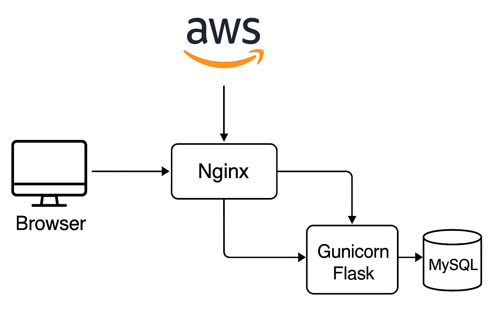

---

# Step-by-Step Deployment Guide

---

## **1. Launch Amazon Linux EC2 Instance**

> **Theory:** You need a cloud server to host your Flask application, and EC2 provides a scalable Linux environment to deploy backend applications.

- Go to AWS → EC2 → Launch Instance
- AMI: **Amazon Linux 2023**
- Instance Type: **t3.micro (Free Tier)**
- Storage: **8GB SSD**
- Security Group inbound rules:
  - **22 (SSH)**
  - **80 (HTTP)**

**Screenshot:**
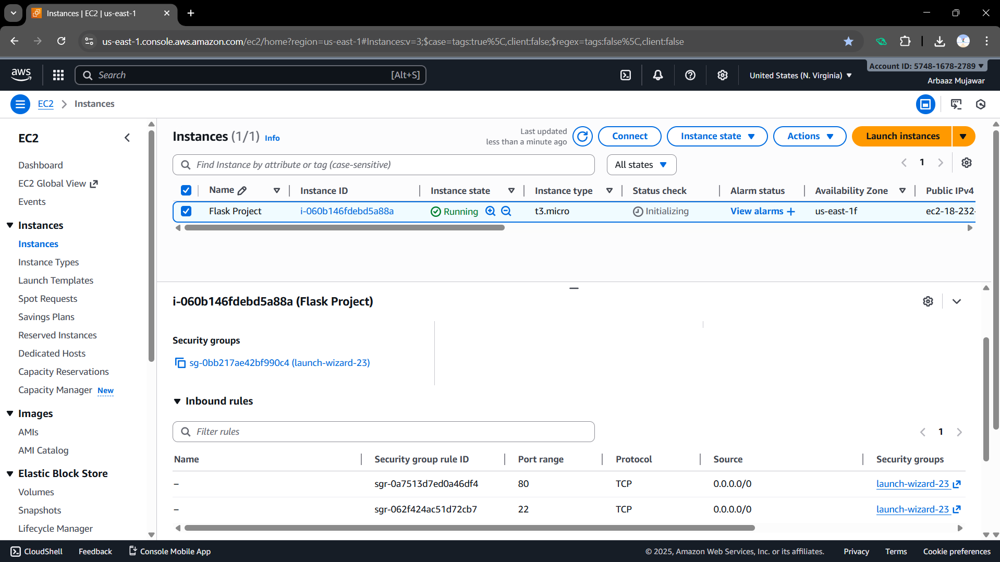

---

## **2. Connect to the instance via SSH**

> **Theory:** SSH allows you to remotely log in to your EC2 server securely so you can install packages, configure services, and deploy your application.
> From your local machine terminal:

```bash
ssh -i "Your_key" ec2-user@<your-ec2-ip>
```

**Screenshot:**

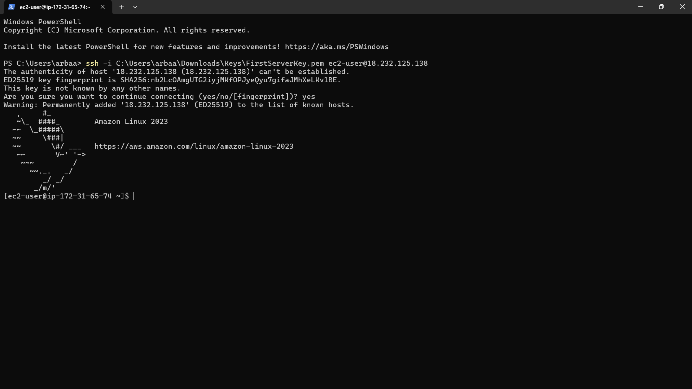

---

## **3. Update Server & Install Essentials**

> **Theory:** Updating the server ensures the latest security patches, and installing Python, Nginx, and other essentials prepares the environment for running Flask apps.

```bash
sudo yum update -y
sudo yum install unzip python3-pip nginx -y
sudo pip3 install virtualenv
```

**Screenshot:**
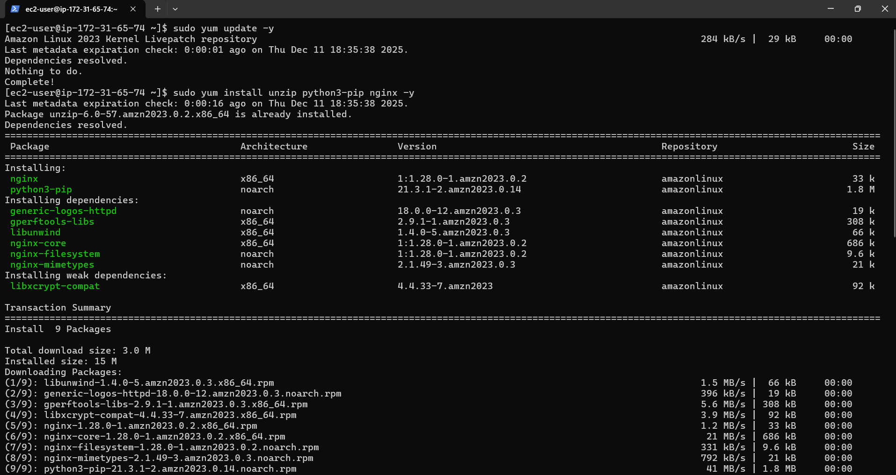

**Screenshot:**
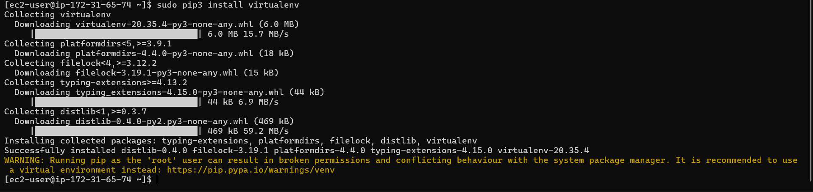

---

## **4. Install & Configure MySQL (MariaDB)**

> **Theory:** MariaDB is the database server where your application will store and manage student data, such as name, email, and login credentials.

### Install and Start MariaDB:

```bash
sudo yum install mariadb105-server -y
sudo systemctl enable mariadb
sudo systemctl start mariadb
sudo mysql
```

### Secure MySQL by creating your password:

```sql
ALTER USER username@localhost IDENTIFIED BY 'Your_Password';

EXIT
```

**Screenshot:**


### Enter your Username and Password:

```bash
sudo mysql -u username -p
```

### Create Database and Students Table:

```sql
CREATE DATABASE student_portal;

USE student_portal;

CREATE TABLE students (
    id INT AUTO_INCREMENT PRIMARY KEY,
    name VARCHAR(100) NOT NULL,
    username VARCHAR(50) DEFAULT NULL,
    email VARCHAR(100) NOT NULL UNIQUE,
    phone VARCHAR(20) DEFAULT NULL,
    gender VARCHAR(10) DEFAULT NULL,
    course VARCHAR(100) DEFAULT NULL,
    password VARCHAR(255) NOT NULL,
    created_at TIMESTAMP DEFAULT CURRENT_TIMESTAMP
);
```

---

## **5. Upload Your Flask Project to EC2**

> **Theory:** Your source code must be transferred from your local machine to the cloud server so it can run in the production environment.

### Upload via SCP

```bash
SCP -i "Your_Primary_key" -r "student-portal.zip" ec2-user@<your-ec2-ip>:.
```

**Screenshot:**
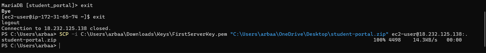

---

## **6. Unzip & Create Python Virtual Environment**

> **Theory:** A virtual environment isolates your Python dependencies, ensuring your app uses the correct versions without interfering with system-level packages.

```bash
unzip student-portal.zip

cd student-portal
virtualenv venv
source venv/bin/activate
pip install -r requirements.txt
```

**Screenshot:**
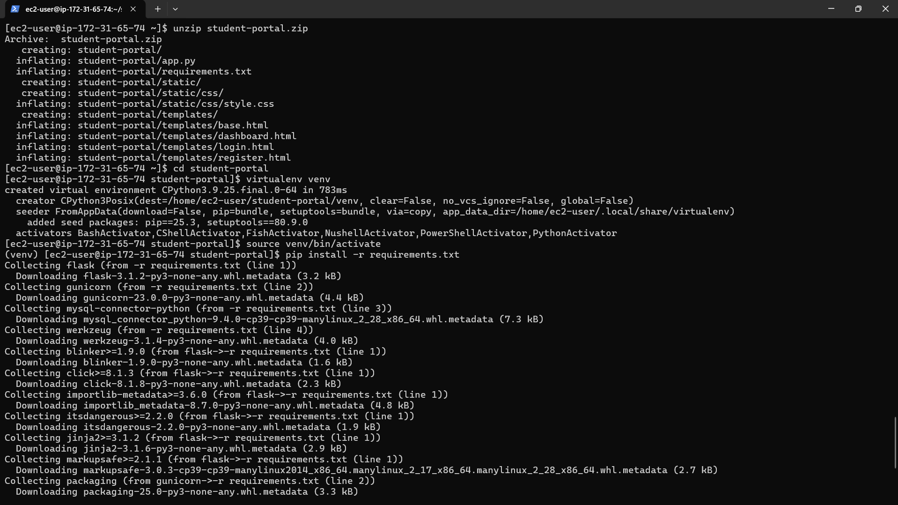

---

## **7. Update Database Credentials in app.py**

> **Theory:** Your Flask app must connect to the correct database using valid credentials so it can perform queries like registration and login.

```bash
sudo nano app.py
```

### Update:

```python
db = mysql.connector.connect(
    host="localhost",
    user="root",
    password="root",
    database="student_portal"
)
```

---

## **8. Test Flask App Locally**

> **Theory:** Testing the app ensures everything works correctly before setting up production services like Gunicorn and Nginx.

```bash
python app.py
```

### Visit in your browser:

```cpp
http://<EC2-IP>:5000
```

Stop with CTRL + C.

---

## **9. Configure Gunicorn**

> **Theory:** Gunicorn is a WSGI server that runs your Flask application in production, handling multiple requests efficiently compared to the Flask development server.

```bash
gunicorn -b 0.0.0.0:5000 app:app
```

Stop it and create a systemd service:

### Create service file:

```bash
sudo nano /etc/systemd/system/studentportal.service
```

### Paste:

```ini
[Unit]
Description=Gunicorn for Student Portal
After=network.target

[Service]
User=ec2-user
Group=ec2-user
WorkingDirectory=/home/ec2-user/student-portal
Environment="PATH=/home/ec2-user/student-portal/venv/bin"
ExecStart=/home/ec2-user/student-portal/venv/bin/gunicorn -b 127.0.0.1:5000 app:app

[Install]
WantedBy=multi-user.target
```

### Start & enable service:

```bash
sudo systemctl daemon-reload
sudo systemctl start studentportal
sudo systemctl enable studentportal
sudo systemctl status studentportal
```

**Screenshot:**
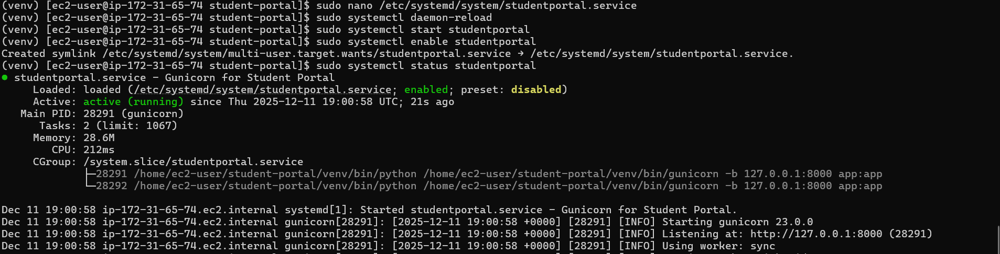

---

## **10. Configure Nginx Reverse Proxy**

> **Theory:** Nginx sits in front of Gunicorn, routing browser requests to the backend and serving static files, improving security, speed, and scalability.

```bash
sudo nano /etc/nginx/conf.d/studentportal.conf
```

### Paste

```nginx
server {
    listen 80;
    server_name _;

    location / {
        proxy_pass http://127.0.0.1:5000;
        proxy_set_header Host $host;
        proxy_set_header X-Real-IP $remote_addr;
    }

    location /static/ {
        alias /home/ec2-user/student-portal/static/;
    }
}
```

### Test & restart:

```bash
sudo nginx -t
sudo systemctl restart nginx
sudo systemctl enable nginx
sudo systemctl status nginx
```

**Screenshot:**
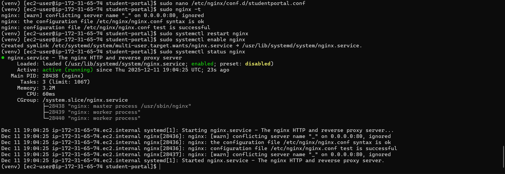

---

## **11. Deployment Success**

> **Theory:** Your application is now hosted on the cloud, accessible over the internet via your EC2 public IP and ready for users.

### Your Flask application is now live at:

```cpp
http://<EC2-PUBLIC-IP>
```

**Screenshot:**
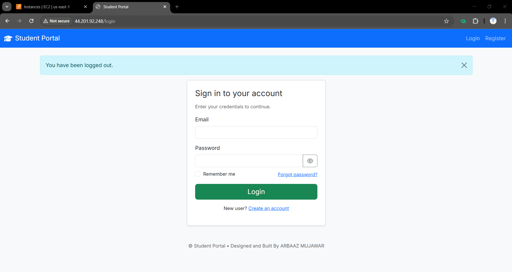
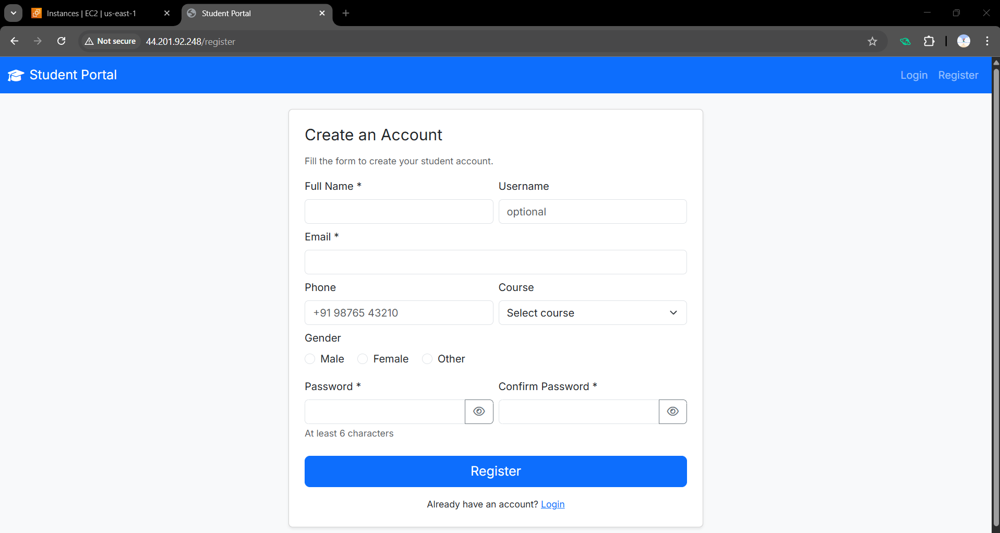
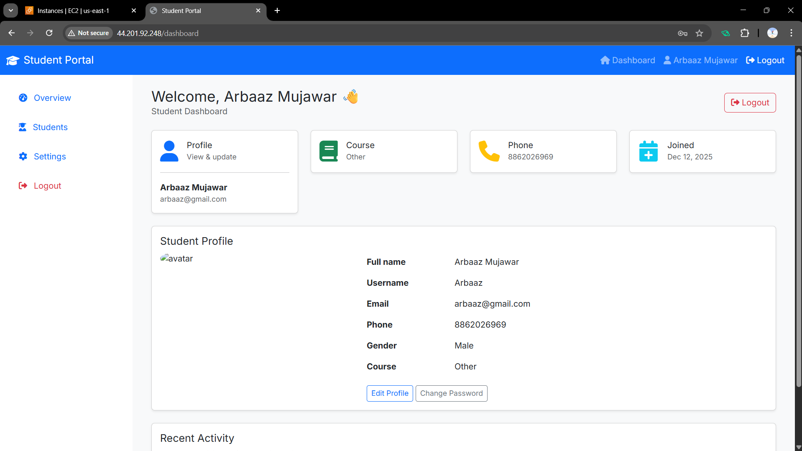
